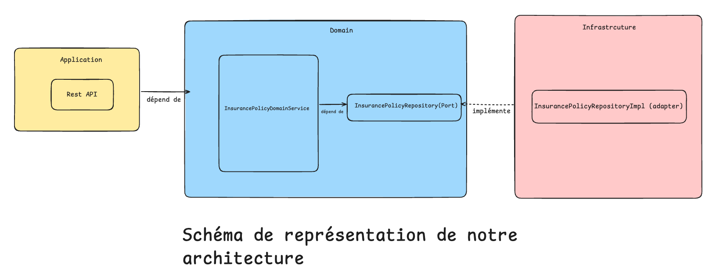

# 🛡️ Insurance Policy API

This is a RESTful API for managing insurance policies, built with Java 17, Spring Boot 3.3.5, and Spring Data JPA.  
It allows users to **create**, **read**, **update**, and **list (with pagination)** insurance policies.

---

## 🧰 Technologies

- Java 17
- Spring Boot 3.3.5
- Spring Web / Spring Validation
- Spring Data JPA
- H2 Database (for development/test)
- MapStruct (DTO and domain mapping)
- Swagger UI (OpenAPI via springdoc)
- Docker

---

## 📦 Features

- Create an insurance policy
- Update an insurance policy
- Retrieve an insurance policy by its ID
- List all policies insurances with pagination and sorting
- Validation errors returned in structured JSON format
- OpenAPI 3 documentation (Swagger UI)
- Containerized with Docker

---

## 🧱 Hexagonal Architecture


----

## 🚀 Getting Started

### ✅ Prerequisites

- Java 17
- Maven 3.9+
- Docker (optional)


### ▶️ Run the app locally

```bash
mvn clean spring-boot:run
```
----

🐳 Run with Docker
```bash
docker build -t assurance-app .
docker run -p 8080:8080 assurance-app
```
-----
🌐 Access the application
Swagger UI: http://localhost:8080/swagger-ui.html

